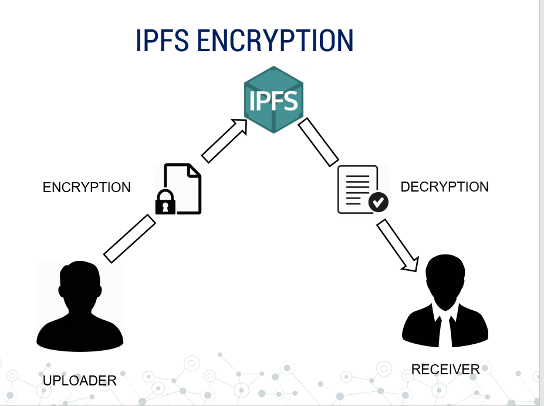

 
         
        

<h1 align="center"> E-Certify </h1>
<h3 align="center"> Blockchain Based Certificate Validation <h3>
  

  
 
  
   
    
  
   
  
  
 

##  E-Certify : About
- It is a blockchain based project for online certificate validation. 
- The major problem of counterfeit certificates can be tackled with the help of E-Certify, as it provides a solution to preserve the       genuineness of a certificate. 
- It works on the idea that: “Only the issuer can upload the certificate and the rest people can only view  it.” The entire process       works on the blockchain in partnership with the IPFS(to provide data security). 
- Does Everything for Certificates : Storing ,Validating and Sharing .
- Thus this is a modern and hassle-free solution to manage certificates and verify them!
## How
- It is D-App on Ethereum([visit](https://www.ethereum.org/)).
- Back-End has Smart Contract 
- Front-end of our Web-App is made with React.Js and our complete frontend components are available at [@gauravsharma-gs](https://github.com/gauravsharma-gs)  /dapper-ui ([visit](https://github.com/gauravsharma-gs/dapper-ui))   
- All User-Data is stored on IPFS([visit](https://ipfs.io/)) also every data is first encryted locally and then send to ipfs to have more security

 

- It create Multi-Sig Wallets for every student where both Student and his/her Institute is Owner.
- We are using Metamask Browser Extension ([visit](https://metamask.io/)) to work with Ethereum.
- We have used Truffle ([visit](https://www.trufflesuite.com/)) for testing our project

## How to Use

### Login
- There are two ways to login
  - Login as `Student`
  - Login as `Institute`
  

 

 - Upon First Signup `Metamask` will ask permission to connect your wallet with App.
 
 

 

- There is an additional security by using `OTP` for Signup .   
- For `Student`  
   -Student need to connect their account with their Institute by giving Institute Address Key .
- For `Institute`  
   -Student will to connect their account with Institute.
   
### Dashboard

 #### Student Dashboard
 
 

 

- Student Dashboard have these options :
 
 - `My Documents`
   - Students can upload their Certificates themselves but these certificates need to be verified by Institute side ,only then                 certificates will appear in my documents section.
 
 - `Give Access`
    - Students can give access to any other institute/organisation to his/her certificates , access is only given for limited time             (24hr)
 
 - `Change Institute` 
    - Students can request change of institute , this request is sent to current institute ,Upon approval students institute is changed. 
   
 #### Institute Dashboard
 
 

 

 
 - Institute Dashboard have these options :
 
 - `Linked Accouts`
   - In this section all student accounts linked to institute are shown.
   - Institute can students certificates from here.
   - Also institute can upload new certificates to students from here.
  
  - `Access Rights`
    - It shows all the student accounts to whom institute has access ,to see their certificates.
  
  - `Pending Approvals`
    - Student requests for certificates approvals appear here .
 
 - `Change Institute Approvals`
   - Student requests for change of institute appear here .
    

