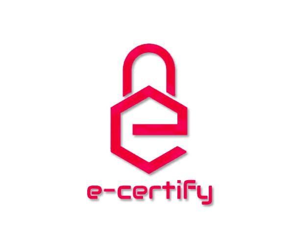

 
         
        

<h1 align="center"> E-Certify </h1>
<h3 align="center"> Blockchain Based Certificate Validation <h3>
  

  
 
  
   
    
  
   
  
  
 

## About

This Simple Implementation of Stone Paper Scissor Game

You vs Computer

- It is Deployed to [Heroku](http://spsgame.herokuapp.com/)
- This project was bootstrapped with [Create React App](https://github.com/facebook/create-react-app).
## How To Play

#### Enter Your Name
 

#### Choose

#### Go

- Computer will randomly generate its choice.
- Result will be shown .
- Simultaneously Score will be updated.

## How to Use ?

- Clone Repo using

  > git clone https://github.com/stanleeniko/Stone-Paper-Scissors.git

- Inside Project Directory
  - Install Dependencies

   > npm install

   - Runs the app in the development mode.

  > npm start

  - Open http://localhost:3000 to view it in the browser.
  - The page will reload if you make edits.
  - You will also see any lint errors in the console.

## License

MIT &copy; Nikhil Sahu
